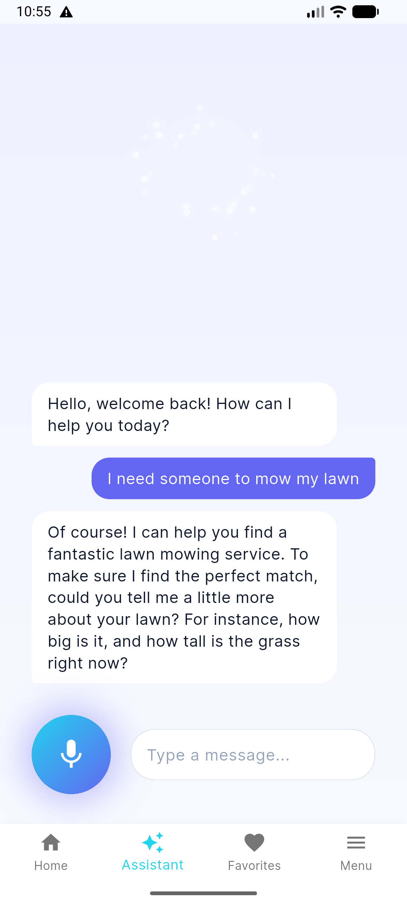
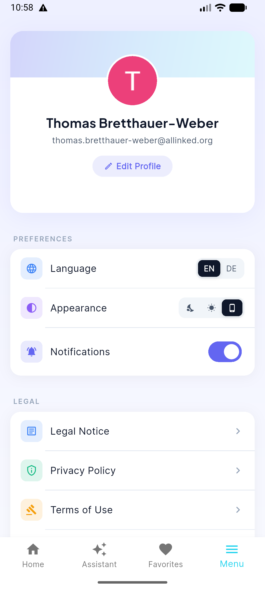
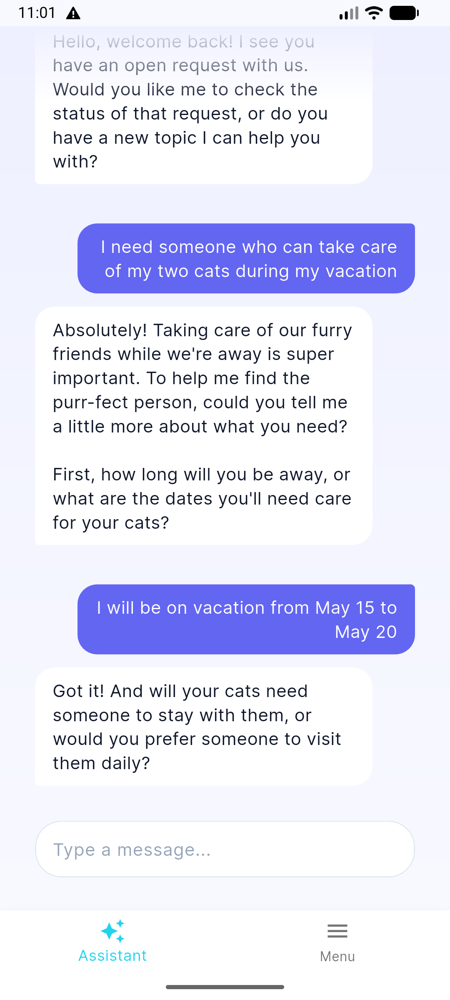
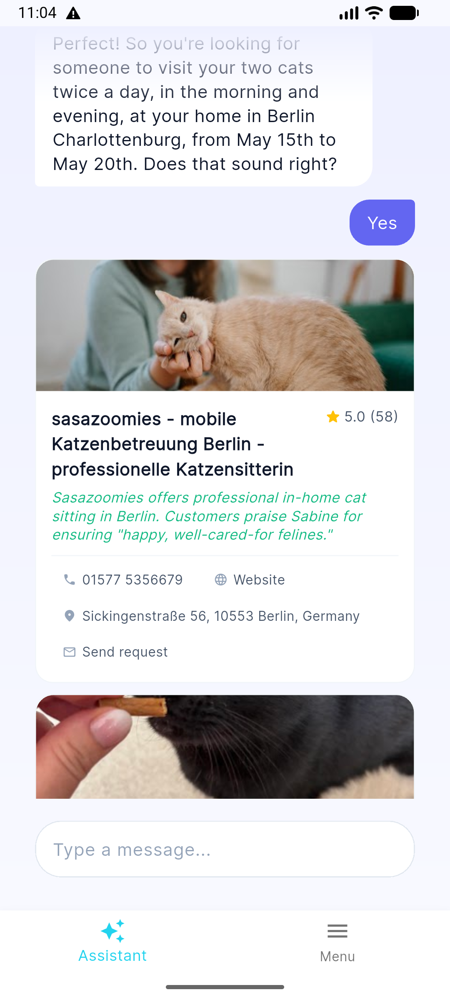
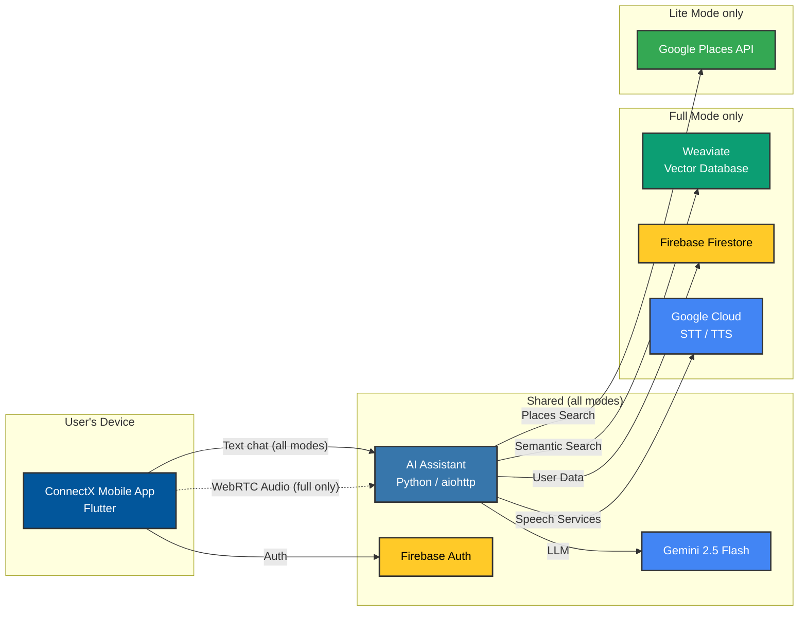

<p align="center">
  <picture>
    <source media="(prefers-color-scheme: dark)" srcset="connectx/assets/images/LinkoraLogo.png">
    
  </picture>
</p>

<p align="center">
  <strong>AI-powered service marketplace assistant. Voice &amp; chat, end-to-end open source.</strong>
</p>

<p align="center">
    
    
    
</p>

<p align="center">
  <a href="docs/getting-started.md">Getting Started</a> ·
  <a href="docs/architecture.md">Architecture</a> ·
  <a href="docs/connectx.md">Mobile App</a> ·
  <a href="docs/ai-assistant.md">Backend</a> ·
  <a href="docs/deployment.md">Deployment</a>
</p>

---

Linkora is a production-ready platform that lets users find local service providers through a **natural conversation** by voice or text. The AI assistant (named **Elin**) guides the user, collects requirements, and returns ranked, enriched provider results. Developers get a complete, deployable stack: a Flutter mobile app, a Python WebRTC server and a vector database, all wired together and ready to customise.

## 📱 App Screenshots

<table>
  <tr>
    <td align="center" width="25%">
      <br>
      <sub><b>Assistant · Full Mode</b></sub><br>
      <sub>Voice &amp; text conversation powered by Weaviate provider search</sub>
    </td>
    <td align="center" width="25%">
      <br>
      <sub><b>Settings · Full Mode</b></sub><br>
      <sub>Language, appearance &amp; notification preferences</sub>
    </td>
    <td align="center" width="25%">
      <br>
      <sub><b>Assistant · Lite Mode</b></sub><br>
      <sub>Text-only chat backed by the Google Places API</sub>
    </td>
    <td align="center" width="25%">
      <br>
      <sub><b>Results · Lite Mode</b></sub><br>
      <sub>AI-curated provider cards with contact &amp; request actions (results anonymized)</sub>
    </td>
  </tr>
</table>

## ✨ Features

- 🎙️ **Voice-first UX**: Real-time WebRTC audio streaming with Google STT/TTS for sub-second round-trips.
- 🤖 **Conversational Search**: The AI assistant, Elin, asks clarifying questions, extracts structured intent, and performs a semantic search.
- 🔀 **Two Deployment Modes**:
    - **Full**: Utilizes a Weaviate vector database with onboarded providers for deep semantic search.
    - **Lite**: Uses Google Places and web enrichment without the extra Weaviate/Firestore infrastructure.
- 🔒 **Secure by Design**: All API keys are kept server-side, and clients authenticate via Firebase for enhanced security.
- 📦 **Batteries Included**: Comes with Docker Compose, Cloud Run deployment scripts, GitHub Actions for CI/CD, and a dev container for a seamless development experience.
- 🧪 **Well-Tested**: A comprehensive suite of over 60 backend unit tests, Flutter unit/service/viewmodel tests, and coverage reporting helps ensure reliability.

## 🛠️ Tech Stack

| Category | Technologies |
|---|---|
| **Mobile App** |   |
| **AI Backend** |     |
| **Database** |   |
| **DevOps** |    |

## 🏗️ Platform Overview


**Read more**: [Architecture Overview](docs/architecture.md)

## 🚀 Getting Started

### Prerequisites
- [Flutter SDK](https://flutter.dev/docs/get-started/install)
- [Python 3.14+](https://www.python.org/downloads/)
- [Docker](https://www.docker.com/products/docker-desktop/)
- [Firebase Account](https://firebase.google.com/)
- [Gemini API key](https://aistudio.google.com/app/apikey)
- [Git LFS](https://git-lfs.com/) (required for the bundled cross-encoder model weights)

### Installation & Setup

1.  **Clone the repository:**
    ```sh
    git clone https://github.com/Fides-Connect/linkora.git
    cd linkora
    ```

2.  **Setup AI Assistant (Backend):**
    ```sh
    cd ai-assistant
    python -m venv .venv
    source .venv/bin/activate
    pip install -e ".[dev]"
    git lfs pull
    ```
    The bundled cross-encoder uses Git LFS; on a fresh clone, run the commands above so `model.safetensors` is downloaded instead of remaining an LFS pointer file.

    Then copy and configure the environment file. The backend will not start without `GEMINI_API_KEY` and Firebase Admin credentials. Also set `AGENT_MODE` to match the app mode you plan to run (`lite` or `full`); the server defaults to `full`, and a mismatch with the app's `APP_MODE` will lead to a broken setup. For Firebase Admin credentials, authenticate locally with Application Default Credentials or point to a service-account key file. If using `AGENT_MODE=lite`, also set `GOOGLE_PLACES_API_KEY`. Without it the backend falls back to a no-op data provider and provider searches return no matches:
    ```sh
    cp .env.template .env
    # Edit .env: set GEMINI_API_KEY, AGENT_MODE, and (for lite) GOOGLE_PLACES_API_KEY

    # Firebase Admin: pick one of the two options below
    # Option 1: Application Default Credentials (recommended for local dev)
    gcloud auth application-default login
    # Option 2: service account key file
    export GOOGLE_APPLICATION_CREDENTIALS=/absolute/path/to/service-account.json
    ```
    See the [AI Assistant docs](docs/ai-assistant.md) for the full list of required variables.

3.  **Setup ConnectX (Mobile App):**
    ```sh
    cd ../connectx
    flutter pub get
    cp .env.template .env
    # Edit .env: set APP_MODE (must match AGENT_MODE above), AI_ASSISTANT_SERVER_URL, GOOGLE_OAUTH_CLIENT_ID
    ```
    The app also requires Firebase config files (not checked in). If you do not already have the FlutterFire CLI installed, install it first:
    ```sh
    dart pub global activate flutterfire_cli
    ```
    Then run `flutterfire configure` from the `connectx` directory to generate `lib/firebase_options.dart`. Android and iOS each need an additional platform-specific config file downloaded from the Firebase Console. See the [ConnectX docs](docs/connectx.md) for the full setup instructions for both platforms.

4.  **Launch and initialize Weaviate (Full mode only):**
    ```sh
    cd ../weaviate
    docker-compose up -d
    ```
    > Starting the container brings up an empty database. Complete the schema and sample-data initialization from the [Getting Started Guide](docs/getting-started.md) before using Full mode. There will be nothing to search against otherwise.

5.  **Run the application:**
    - Start the AI Assistant backend:
      ```sh
      cd ../ai-assistant
      source .venv/bin/activate
      python -m ai_assistant
      ```
    - In a separate terminal, launch the Flutter app with the required build flavor (Android). The selected flavor must match `APP_MODE` in `connectx/.env` (`liteDev`/`liteProd` → `APP_MODE=lite`; `fullDev`/`fullProd` → `APP_MODE=full`):
      ```sh
      cd ../connectx
      flutter run --flavor liteDev   # or fullDev, liteProd, fullProd
      ```

For full mobile-app setup instructions including Firebase configuration, see the [ConnectX docs](docs/connectx.md). For Weaviate schema and sample-data initialization, see the [Getting Started Guide](docs/getting-started.md).

## 📁 Repository Structure

```
linkora/
├── docs/                 # 📖 Comprehensive documentation for architecture, setup, and deployment.
├── connectx/             # 📱 Flutter mobile application for iOS and Android.
├── ai-assistant/         # 🤖 Python-based AI backend with aiohttp and WebRTC.
├── weaviate/             # 🗃️ Docker configuration for the Weaviate vector database.
└── .github/              # ⚙️ GitHub Actions for CI/CD workflows.
```

## 🤝 Contributing

Contributions are welcome! Please feel free to submit a pull request or open an issue to discuss your ideas.

1.  Fork the Project
2.  Create your Feature Branch (`git checkout -b feature/AmazingFeature`)
3.  Commit your Changes (`git commit -m 'Add some AmazingFeature'`)
4.  Push to the Branch (`git push origin feature/AmazingFeature`)
5.  Open a Pull Request

## 📄 License

This project is licensed under the MIT License - see the [LICENSE](LICENSE) file for details.


