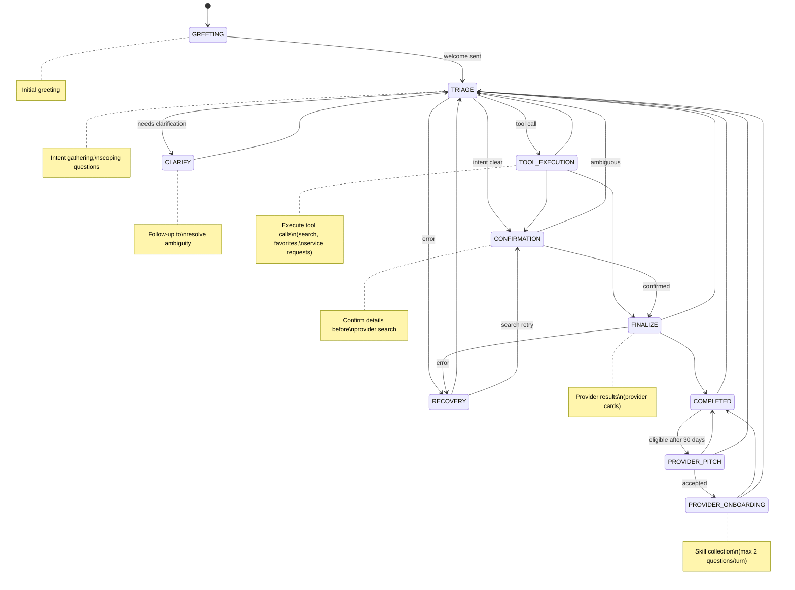
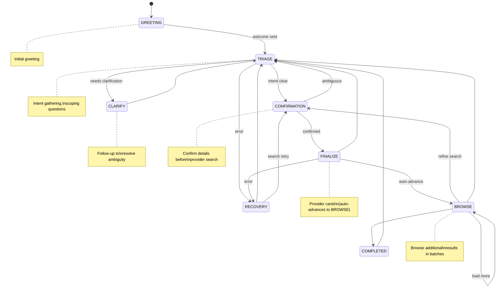

# AI-Assistant - Backend Server

The AI-Assistant is the Python-based WebRTC server that powers the Linkora voice interaction platform, handling speech recognition, AI processing, and audio synthesis.

## 📋 Table of Contents

- [Overview](#overview)
- [Features](#features)
- [Architecture](#architecture)
- [Installation](#installation)
- [Configuration](#configuration)
- [Running the Server](#running-the-server)
- [API Endpoints](#api-endpoints)
- [Testing](#testing)
- [Deployment](#deployment)
- [Performance Tuning](#performance-tuning)
- [Troubleshooting](#troubleshooting)

## 🎯 Overview

The AI-Assistant server is a containerized service that:
- Receives audio streams from clients via WebRTC
- Converts speech to text using Google Cloud Speech API
- Processes queries using Google Gemini 2.5 Flash
- Generates natural-sounding responses using Google Cloud TTS
- Streams audio responses back to clients
- Manages multi-stage conversations
- Synchronizes data between Firestore (Document) and Weaviate (Vector) databases
- Performs semantic provider matching using Weaviate

### Why Server-Side Processing?

**Benefits:**
- 🔒 **Secure**: API credentials stay on server
- ⚡ **Efficient**: Offloaded processing from mobile devices
- 🔋 **Battery-Friendly**: Reduced client resource usage
- 🔄 **Centralized**: Easy updates without app redeployment
- 🌐 **Multi-Platform**: Works with any WebRTC-capable client

## ✨ Features

### Core Capabilities

- **Real-Time Voice Processing**: Low-latency continuous speech recognition
- **Streaming Pipeline**: Full streaming STT → LLM → TTS for minimal latency
- **Multi-Stage Conversations**: Dynamic prompt switching (greeting, triage, finalization)
- **Interrupt Support**: User can interrupt AI responses by speaking
- **Parallel Processing**: Multiple TTS tasks run simultaneously
- **Intelligent Provider Matching**: Weaviate vector search for semantic matching
- **Multi-Language Support**: Configurable language and voice settings
- **Chat Context**: Maintains conversation history per session
- **Scalable Architecture**: Stateless design for horizontal scaling

### Conversation Stages

The assistant uses a different state machine for each deployment mode.

#### Full Mode



#### Lite Mode



`TRIAGE`, `FINALIZE`, and `RECOVERY` are the primary error-recovery entry points. `RECOVERY` returns to `TRIAGE` (general retry) or `CONFIRMATION` (search retry).

### Technical Features

- **Native gRPC Streaming**: 30-50% lower latency than REST
- **Streaming APIs**: STT, LLM, and TTS all stream
- **Sentence-Level Parallelization**: TTS processes multiple sentences simultaneously
- **Fully Async**: No thread pool overhead
- **Transcript-Based Interrupts**: Detects user speech to stop AI
- **Health Check Endpoints**: For monitoring and load balancing
- **Docker Containerization**: Easy deployment and scaling
- **Push Notifications**: FCM notifications for service-request status changes, localised per recipient
- **App Settings Sync**: Language and notification preferences stored in Firestore and synced to the app on login

## 🏗️ Architecture

### Component Structure

```
ai-assistant/
├── src/ai_assistant/
│   ├── __main__.py                # Application entry point
│   ├── ai_assistant.py            # Core orchestration layer
│   ├── audio_processor.py         # STT→LLM→TTS hot path; interrupt gate
│   ├── audio_track.py             # Audio track handling
│   ├── chat_connection_handler.py # Per-connection handler for lite-mode /ws/chat
│   ├── peer_connection_handler.py # WebRTC management (full mode)
│   ├── signaling_server.py        # WebSocket/WebRTC signaling entry
│   ├── common_endpoints.py        # Shared API endpoints (health, etc.)
│   ├── data_provider.py           # Data access abstraction
│   ├── firestore_service.py       # Firestore service (full mode)
│   ├── firestore_schemas.py       # Pydantic schemas for Firestore documents
│   ├── seed_data.py               # Template data for user seeding
│   ├── hub_spoke_schema.py        # Weaviate hub-spoke schema definition (full mode)
│   ├── hub_spoke_ingestion.py     # Weaviate write/ingest pipeline (full mode)
│   ├── hub_spoke_search.py        # Weaviate search logic (full mode)
│   ├── weaviate_config.py         # Weaviate connection config
│   ├── weaviate_models.py         # Weaviate data models
│   ├── prompts_templates.py       # All LLM prompt strings
│   ├── api/                       # REST API (v1 routes)
│   │   ├── deps.py                # Dependency injection and auth
│   │   └── v1/
│   │       ├── router.py          # API v1 router
│   │       └── endpoints/
│   │           ├── auth.py        # Authentication endpoints
│   │           ├── me.py          # Current user profile & settings
│   │           ├── users.py       # User management
│   │           ├── service_requests.py
│   │           ├── reviews.py
│   │           └── ai_conversations.py
│   ├── localization/              # Push notification i18n strings
│   └── services/
│       ├── admin_service.py           # Admin interface
│       ├── agent_profile.py           # AgentProfile (full vs lite feature flags)
│       ├── agent_runtime_fsm.py       # Deterministic 11-state runtime FSM
│       ├── agent_tools.py             # Tool registry & capability checks
│       ├── ai_conversation_service.py # AI conversation persistence (30-day TTL)
│       ├── chat_bridge.py             # Chat ↔ AudioProcessor bridge
│       ├── competence_enricher.py     # Competency AI enrichment (full mode)
│       ├── conversation_service.py    # Stage FSM + context tracking
│       ├── cross_encoder_service.py   # ms-marco cross-encoder reranking (singleton)
│       ├── data_channel_bridge.py     # DataChannel ↔ AudioProcessor bridge
│       ├── google_places_service.py   # GP pipeline: fetch → crawl → ingest (lite mode)
│       ├── llm_service.py             # Gemini 2.5 Flash streaming
│       ├── notification_service.py    # FCM push notifications (localised)
│       ├── response_delivery.py       # Sends final chunks to DataChannel / WS
│       ├── response_orchestrator.py   # Stage transitions + tool dispatch
│       ├── session_starter.py         # Session initialisation and greeting
│       ├── session_mode.py            # SessionMode enum (voice / text)
│       ├── speech_to_text_service.py  # Google STT (gRPC streaming)
│       ├── text_to_speech_service.py  # Google TTS (Chirp3-HD)
│       ├── tts_playback_manager.py    # Parallel sentence-level TTS
│       ├── transcript_processor.py    # STT transcript → response pipeline
│       ├── user_seeding_service.py    # Dev/demo user seeding
│       ├── webpage_crawler.py         # Web-crawl enrichment for GP providers
│       └── ws_bridge.py               # WebSocket bridge (lite-mode transport)
├── scripts/
│   ├── init_database.py           # Database init (Firestore + Weaviate)
│   ├── delete_weaviate_user.py
│   ├── generate_admin_token.py
│   ├── test_admin_interface.py
│   └── test_search_providers.py
├── tests/                         # Unit and integration tests

### Data Architecture: Hub & Spoke

The system uses a **Hybrid Database Architecture**:
1.  **Firestore**: Acts as the "Ground Truth" for relational data (Users, Service Requests, Reviews, Chat).
2.  **Weaviate**: Acts as the "Search Engine" for semantic matching (Competencies, Providers).

**Synchronization Flow:**
- Writes go primarily to Firestore.
- `HubSpokeIngestion` service syncs relevant changes (User profile, Competencies) to Weaviate in real-time.
- `init_database.py` script ensures initial sync and test data population.

**Hub & Spoke Model (Weaviate):**
- **Hub**: The `User` object.
- **Spoke**: The `Competence` (skill/service) object.
- **Link**: Bidirectional references (`owned_by` <-> `has_competencies`).
- This allows searching for specific skills ("Spokes") while retrieving the full provider profile ("Hub").
├── Dockerfile                     # Container definition
├── docker-compose.yml             # Development setup
├── pyproject.toml                 # Dependencies
└── main.py                        # Entry point wrapper
```

### Processing Pipeline

```
Audio Stream (WebRTC)
    ↓
AudioProcessor
    ├─→ STT Streaming (gRPC)
    │       ↓
    │   Transcript Buffer
    │       ↓
    └─→ ResponseOrchestrator
            ├─→ ConversationService
            │   ├─→ Stage Management
            │   └─→ Context Tracking
            │
            ├─→ Gemini 2.5 Flash (Streaming)
            │       ↓
            │   AI Response Stream
            │
            ├─→ DataProvider (if needed)
            │   └─→ Weaviate Search
            │
            └─→ TTS (Parallel)
                    ↓
                Audio Chunks
                    ↓
            WebRTC Stream → Client
```

## 🚀 Installation

### Prerequisites

- **Python**: 3.14 or higher
- **Docker**: For containerized deployment
- **Google Cloud Platform**: Account with enabled APIs
- **Google Gemini**: API key

### Step 1: Python Environment Setup

```bash
cd ai-assistant

# Create virtual environment
python3 -m venv ../.venv
source ../.venv/bin/activate  # Windows: ..\.venv\Scripts\activate

# Install in development mode
pip install -e .
pip install -e ".[dev]"
```

**Why development mode (`pip install -e .`)?**  
This makes imports like `from ai_assistant.hub_spoke_schema import ...` work correctly throughout the project without manual path manipulation.

### Step 2: Google Cloud Setup

#### Create Service Account

1. Go to [Google Cloud Console](https://console.cloud.google.com)
2. Navigate to IAM & Admin → Service Accounts
3. Create service account with roles:
   - Cloud Speech-to-Text User
   - Cloud Text-to-Speech User
4. Create and download JSON key file
5. Place in `ai-assistant/` directory

#### Enable Required APIs

```bash
gcloud services enable speech.googleapis.com
gcloud services enable texttospeech.googleapis.com
```

#### Get Gemini API Key

1. Visit [Google AI Studio](https://makersuite.google.com/app/apikey)
2. Create new API key
3. Save for environment configuration

### Step 3: Environment Configuration

```bash
# Copy template
cp .env.template .env

# Edit configuration
nano .env
```

**Required Environment Variables:**

```bash
# Gemini AI
GEMINI_API_KEY=your_gemini_api_key_here

# Agent mode: "full" (default) or "lite"
# full  — Weaviate vector search + voice + Firestore (full platform)
# lite  — Google Places API search + text-only (no Weaviate, no Firestore)
AGENT_MODE=full

# Firestore Database Configuration
# Specify which Firestore database to use (e.g., "development", "production")
# This database must be created in your Firestore instance beforehand
# If not set, defaults to "(default)" database
# Not required in lite mode.
FIRESTORE_DATABASE_NAME=(default)

# Weaviate Configuration (full mode only)
# Local Weaviate (self-hosted)
WEAVIATE_URL=http://localhost:8090

# Cloud Weaviate (Weaviate Cloud Services - takes precedence over local WEAVIATE_URL)
# WEAVIATE_CLUSTER_URL=https://your-cluster.weaviate.network
# WEAVIATE_API_KEY=your-weaviate-cloud-api-key

# Google Places API key (required for lite mode, optional for full mode)
# GOOGLE_PLACES_API_KEY=your_places_api_key_here

# Language and Voice Configuration
# German configuration
LANGUAGE_CODE_DE=de-DE
VOICE_NAME_DE=de-DE-Chirp3-HD-Sulafat
# English configuration
LANGUAGE_CODE_EN=en-US
VOICE_NAME_EN=en-US-Chirp3-HD-Sulafat

# Server Configuration
PORT=8080
LOG_LEVEL=INFO

# Session idle timeout — close inactive connections after this many minutes
# Applies to both WebRTC (full mode) and WebSocket chat (lite mode)
# Default: 10 minutes
SESSION_IDLE_TIMEOUT_MINUTES=10
```

## ⚙️ Configuration

### Weaviate Configuration

The AI Assistant uses Weaviate for provider search and data persistence.

**Deployment Options:**

**Option 1: Local/Self-Hosted (Development)**
```bash
WEAVIATE_URL=http://localhost:8090
```
- Start local Weaviate in Docker: `cd weaviate && docker-compose up`
- See [Weaviate Documentation](weaviate.md) for detailed setup

**Option 2: Weaviate Cloud Services (Production)**
```bash
WEAVIATE_CLUSTER_URL=https://your-cluster.weaviate.network
WEAVIATE_API_KEY=your-weaviate-cloud-api-key
```
- Create cluster at https://console.weaviate.cloud/
- Takes precedence over local WEAVIATE_URL if both are set

**Features:**
- Semantic provider matching using vector embeddings
- Persistent data storage
- Hybrid search (vector + keyword)
- Support for both local and cloud deployments

### Lite Mode (no Weaviate)

Set `AGENT_MODE=lite` to run the assistant with the Google Places API as the
provider source instead of Weaviate. This requires only a single container — no
Weaviate VM, no VPC connector.

**Pipeline:**
```
User query
    │
    ▼
generate_query()      — LLM distils intent + location
    │
    ▼
Google Places API     — returns up to 20 nearby providers
    │
    ▼
WebPageCrawler        — enriches each provider (skills, email, portfolio)
    │
    ▼
ms-marco cross-encoder — reranks by semantic relevance
    │
    ▼
FINALIZE prompt / Flutter card renderer
```

**Key differences from full mode:**

| | Full mode | Lite mode |
|---|---|---|
| Voice | Enabled | Text-only |
| Provider storage | Weaviate (persistent) | Google Places (ephemeral) |
| Provider onboarding | Full tool flow | Not available |
| Firestore | Required | Not required |
| Session modes | `?mode=voice` and `?mode=text` | `?mode=text` only |

**Required env vars:**

```bash
AGENT_MODE=lite
GEMINI_API_KEY=your_gemini_api_key_here
GOOGLE_PLACES_API_KEY=your_places_api_key_here
```

**Local lite mode with Docker Compose:**

```bash
cd ai-assistant
AGENT_MODE=lite GOOGLE_PLACES_API_KEY=your_key docker-compose up ai-assistant
```

No `weaviate` service needs to be started. No `init_database.py` needed.

**Circuit breaker**: if the Google Places API returns errors on multiple
consecutive calls, the circuit opens and `search_providers` returns an empty
list with a user-friendly error message. The circuit resets after 60 seconds.

**Crawler enrichment**: each Google Places result is enriched before being
presented to the user. The following fields are populated when the provider's
website is reachable:

| Field | Source |
|---|---|
| `skills_list` | Crawled services / specialities |
| `email` | Crawled contact section |
| `description` | Crawled portfolio highlights + coverage area |
| `search_optimized_summary` | Crawled specialities + services combined |
| `webpage_crawled` | Set to `true` when enrichment succeeds |

### Voice Configuration

**Supported Languages:**
- German (`de-DE`) - Configured via `LANGUAGE_CODE_DE` and `VOICE_NAME_DE`
- English (`en-US`) - Configured via `LANGUAGE_CODE_EN` and `VOICE_NAME_EN`

**Configuration:**

Set language and voice parameters in `.env`:

```bash
# German configuration
LANGUAGE_CODE_DE=de-DE
VOICE_NAME_DE=de-DE-Chirp3-HD-Sulafat

# English configuration
LANGUAGE_CODE_EN=en-US
VOICE_NAME_EN=en-US-Chirp3-HD-Sulafat
```

**Available Voices:**

**German (de-DE):**
- `de-DE-Chirp3-HD-Sulafat` - Chirp3 HD model (recommended)
- `de-DE-Neural2-A` - Female
- `de-DE-Neural2-B` - Male
- `de-DE-Neural2-C` - Female
- `de-DE-Neural2-D` - Male

**English (en-US):**
- `en-US-Chirp3-HD-Kore` - Chirp3 HD model (recommended)
- `en-US-Neural2-A` - Female
- `en-US-Neural2-C` - Male
- `en-US-Neural2-E` - Female
- `en-US-Neural2-F` - Male

See [Google TTS Voice List](https://cloud.google.com/text-to-speech/docs/voices) for more options.

## 🏃 Running the Server

### Docker (Recommended)

```bash
cd ai-assistant

# Start server
docker-compose up ai-assistant

# Start in background
docker-compose up -d ai-assistant

# View logs
docker-compose logs -f ai-assistant

# Stop server
docker-compose down
```

**Server starts on**: `http://localhost:8080`

### Local Development

```bash
cd ai-assistant

# Activate virtual environment
source ../.venv/bin/activate

# Run server
python main.py

# Or with auto-reload
python -m uvicorn ai_assistant.main:app --reload --host 0.0.0.0 --port 8080
```

### With Weaviate (full mode)

```bash
# Terminal 1: Start Weaviate
cd weaviate
docker-compose up -d

# Terminal 2: Initialize database
cd ../ai-assistant
python scripts/init_database.py --load-test-data

# Terminal 3: Start AI-Assistant
docker-compose up ai-assistant
```

## 🔌 API Endpoints

All REST endpoints are under `/api/v1/` and require a Firebase Bearer token unless noted.

### Health Check & Signaling

```bash
GET  /health                          # Service health status
WS   /ws?mode=voice|text              # WebRTC signaling (full mode)
WS   /ws/chat?language=<lang>         # Text-only WebSocket chat (lite mode)
```

### Authentication

```bash
POST /api/v1/auth/sign-in-google      # Exchange Google OAuth token for session
POST /api/v1/auth/sync                # Sync user data (Firestore ↔ Weaviate)
POST /api/v1/auth/logout              # User logout
```

### Current User (/me)

```bash
GET   /api/v1/me                      # Get current user profile
PATCH /api/v1/me                      # Update current user profile

GET    /api/v1/me/favorites           # List favorites
POST   /api/v1/me/favorites           # Add a favorite
DELETE /api/v1/me/favorites/{user_id} # Remove a favorite

GET    /api/v1/me/competencies                      # List competencies
POST   /api/v1/me/competencies                      # Add competence
PATCH  /api/v1/me/competencies/{competence_id}      # Update competence
DELETE /api/v1/me/competencies/{competence_id}      # Remove competence

GET   /api/v1/me/settings             # Get app settings (language, notifications)
PATCH /api/v1/me/settings             # Update app settings
```

**Settings payload:**
```json
{ "language": "de", "notifications_enabled": true }
```
Supported keys: `language` (ISO 639-1 code), `notifications_enabled` (bool). Unknown keys are ignored. Defaults: `language=en`, `notifications_enabled=true`.

### User Management

```bash
POST   /api/v1/users           # Create user
GET    /api/v1/users/{user_id} # Get public profile
DELETE /api/v1/users/{user_id} # Delete user
```

### Service Requests

```bash
GET    /api/v1/service-requests        # List all requests for the current user
POST   /api/v1/service-requests        # Create new service request
GET    /api/v1/service-requests/{id}   # Get a single service request
PATCH  /api/v1/service-requests/{id}   # Update service request fields
PATCH  /api/v1/service-requests/{id}/status  # Advance the request status
DELETE /api/v1/service-requests/{id}   # Delete service request
```

**Status transitions (role-based):**

| Role | Current status | Allowed next status |
|---|---|---|
| Provider | `pending`, `waitingForAnswer` | `accepted`, `rejected` |
| Provider | `accepted` | `serviceProvided` |
| Seeker | `pending`, `waitingForAnswer`, `accepted` | `cancelled` |
| Seeker | `serviceProvided` | `completed` |

A push notification is sent to the other party on every successful transition.

### Service Request Chats

```bash
GET  /api/v1/service-requests/{id}/chats              # List chat sessions
POST /api/v1/service-requests/{id}/chats              # Start a chat session
GET  /api/v1/service-requests/{id}/chats/{chat_id}    # Get chat details
```

### Reviews

```bash
POST   /api/v1/reviews                # Create review
GET    /api/v1/reviews/{id}           # Get review
GET    /api/v1/reviews/user/{id}      # Reviews received by a user
GET    /api/v1/reviews/reviewer/{id}  # Reviews written by a user
PATCH  /api/v1/reviews/{id}           # Update review
DELETE /api/v1/reviews/{id}           # Delete review
```

### AI Conversations

```bash
GET /api/v1/ai-conversations          # List AI conversation history
```

### Admin Interface

```bash
GET /admin/test-search?query=...      # Test provider search
GET /admin/conversations/{uid}        # View conversation history
```

## 🧪 Testing

### Run All Tests

```bash
cd ai-assistant
pytest
```

### Run Specific Test

```bash
pytest tests/test_audio_processor.py
pytest tests/test_conversation_service.py -v
```

### Test Coverage

```bash
pytest --cov=src tests/
pytest --cov=src --cov-report=html tests/
open htmlcov/index.html
```

### Test Categories

**Unit Tests:**
```bash
pytest tests/test_audio_processor.py
pytest tests/test_response_orchestrator.py
pytest tests/test_conversation_service.py
```

**Integration Tests:**
```bash
pytest tests/test_hub_spoke_architecture.py
pytest tests/test_weaviate_models.py
```

**End-to-End Tests:**
```bash
pytest tests/test_ai_assistant.py
```

### Manual Testing

**Test Provider Search:**
```bash
python scripts/test_search_providers.py
```

**Test Admin Interface:**
```bash
# Generate admin token
python scripts/generate_admin_token.py

# Test admin endpoints
python scripts/test_admin_interface.py
```

## 🚀 Deployment

### Docker Container

**Build Image:**
```bash
docker build -t ai-assistant:latest .
```

**Run Container:**
```bash
docker run -d \
  -p 8080:8080 \
  -e GEMINI_API_KEY=your_key \
  -e GOOGLE_APPLICATION_CREDENTIALS=/app/adc.json \
  -v $HOME/.config/gcloud/application_default_credentials.json:/app/adc.json:ro \
  ai-assistant:latest
```

### Cloud Run (Production)

Deployed automatically via CI/CD. See [Deployment Documentation](deployment.md) for the full setup.

```bash
# Manual redeploy with latest image
gcloud run deploy ai-assistant \
  --image europe-west3-docker.pkg.dev/<PROJECT_ID>/ai-assistant/ai-assistant:latest \
  --region europe-west3
```

### Environment-Specific Configuration

**Production (Cloud Run):**
```
WEAVIATE_URL: http://<WEAVIATE_VM_IP>:8090
GEMINI_MODEL: gemini-2.5-flash
MIN_INSTANCES: 1 / MAX_INSTANCES: 3
MEMORY: 1Gi / CPU: 1
```

## ⚡ Performance Tuning

### Latency Optimization

**Current Performance:**
- STT Latency: ~100-300ms (streaming)
- LLM Latency: ~500-1500ms (streaming)
- TTS Latency: ~200-500ms per sentence
- End-to-End: ~1-2 seconds for first response

**Optimization Techniques:**

1. **Parallel TTS Processing**
   ```python
   # Multiple sentences synthesized simultaneously
   tts_tasks = [synthesize(sentence) for sentence in sentences]
   results = await asyncio.gather(*tts_tasks)
   ```

2. **gRPC Streaming**
   ```python
   # Use native gRPC for 30-50% lower latency
   responses = stt_client.streaming_recognize(audio_generator())
   ```

3. **Sentence-Level Streaming**
   ```python
   # Stream TTS as soon as sentences are complete
   for sentence in llm_stream:
       asyncio.create_task(synthesize_and_stream(sentence))
   ```

### Resource Management

**Connection Limits:**
```python
# In main.py
MAX_CONNECTIONS = 100
TIMEOUT_SECONDS = 300
```

**Memory Usage:**
- Base: ~500MB
- Per Connection: ~50MB
- Recommended: 2GB RAM per instance

**CPU Usage:**
- STT: ~10-20% per stream
- TTS: ~15-25% per synthesis
- LLM: Depends on Google API
- Recommended: 1 CPU per instance

## 🐛 Troubleshooting

### Common Issues

#### Server Won't Start

**Symptoms**: Docker container exits immediately

**Solution**:
```bash
# Check logs
docker-compose logs ai-assistant

# Common issues:
# - Missing environment variables
# - Port 8080 already in use

# Fix port conflict
lsof -i :8080
kill -9 <PID>
```

#### Google Cloud API Errors

**Symptoms**: "403 Forbidden" or "401 Unauthorized"

**Solution**:
1. Verify the GKE service account has the correct IAM roles (Speech, TTS)
2. Check APIs are enabled in GCP project
3. Confirm Workload Identity binding is configured

```bash
# Test that ADC resolves correctly (on GKE the pod should get credentials automatically)
gcloud auth application-default print-access-token
```

#### WebRTC Connection Failed

**Symptoms**: Client can't establish connection

**Solution**:
1. Check server is running: `curl http://localhost:8080/health`
2. Verify WebSocket endpoint: `curl -i http://localhost:8080/ws`
3. Check firewall rules allow port 8080
4. Review server logs for connection errors
5. Verify client uses correct server URL

#### Weaviate Connection Failed

**Symptoms**: "Connection refused" to Weaviate

**Solution**:
```bash
# Check Weaviate is running
curl http://localhost:8090/v1/meta

# If not running
cd weaviate
docker-compose up -d

# Verify network connectivity
docker network ls
docker network inspect weaviate-network
```

#### High Latency

**Symptoms**: Slow responses, timeouts

**Solution**:
1. Check network connectivity to Google APIs
2. Verify gRPC streaming is enabled
3. Review logs for processing times
4. Consider scaling to more instances
5. Check Weaviate performance

### Debug Mode

Enable detailed logging:

```bash
# In .env
LOG_LEVEL=DEBUG

# Or at runtime
export LOG_LEVEL=DEBUG
python main.py
```

**Log Levels:**
- `DEBUG`: Detailed diagnostic information
- `INFO`: General informational messages
- `WARNING`: Warning messages
- `ERROR`: Error messages only

### Performance Monitoring

**Built-in Metrics:**
```python
# Response times logged automatically
logger.info(f"STT latency: {stt_time:.2f}s")
logger.info(f"LLM latency: {llm_time:.2f}s")
logger.info(f"TTS latency: {tts_time:.2f}s")
```

**External Monitoring:**
- Prometheus metrics endpoint (if enabled)
- Cloud Monitoring (GKE deployments)
- Application logs

## 🔒 Security Considerations

### API Key Management
- Store keys in environment variables
- Never commit keys to git
- Use Kubernetes secrets in production
- Rotate keys regularly

### Authentication
- Validate Firebase tokens on every request
- Implement rate limiting
- Use HTTPS/TLS in production
- Restrict CORS origins

### Network Security
- Use private networks for Weaviate
- Firewall rules for GKE clusters
- VPN for admin access
- TLS for all external communications

## 🔗 Related Documentation

- [Weaviate Documentation](weaviate.md) - Database setup
- [ConnectX Documentation](connectx.md) - Mobile client
- [Architecture Overview](architecture.md) - System design
