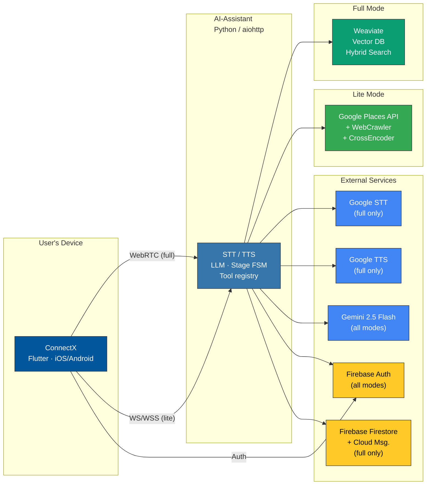
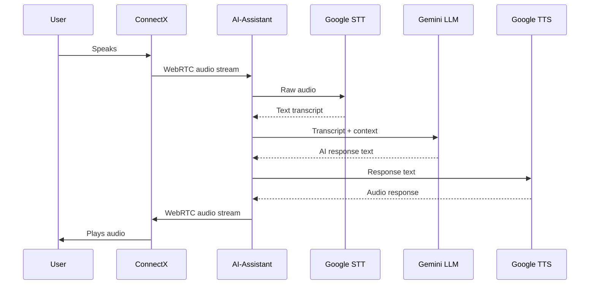

# Architecture Overview

This document describes the architecture, design decisions, and technical implementation of the Linkora AI Voice Assistant platform.

## 🏗️ System Architecture

### High-Level Architecture



### Full-Mode Voice Interaction Flow

This sequence shows the **full-mode voice path only**. Lite sessions use the `/ws/chat` text transport and do **not** call Google STT or Google TTS.



## 🎯 Design Principles

### 1. Security First
- **API Keys on Server**: All credentials remain server-side
- **Token-Based Auth**: Firebase JWT tokens for authentication
- **TLS in Production**: Encrypted communication channels
- **Service Account Isolation**: Minimal GCP permissions

### 2. Low Latency
- **WebRTC P2P**: Direct peer-to-peer audio streaming
- **Streaming APIs**: STT, LLM, and TTS all stream responses
- **Async Pipeline**: Non-blocking I/O throughout
- **Parallel Processing**: Multiple TTS tasks run simultaneously
- **Native gRPC**: 30-50% lower latency vs REST

### 3. Scalability
- **Stateless Server**: Horizontally scalable
- **Connection-Based State**: No shared session storage
- **Docker Containers**: Easy deployment and scaling
- **Cloud Ready**: Cloud Run + Compute Engine deployment

### 4. Developer Experience
- **Clear Separation**: Frontend/backend boundaries
- **Standard Tools**: Flutter, Python, Docker
- **Comprehensive Tests**: Unit, integration, and E2E tests
- **CI/CD Automation**: GitHub Actions pipelines

## 📱 ConnectX (Mobile Application)

### Technology Stack
- **Framework**: Flutter 3.9.2+
- **Language**: Dart
- **WebRTC**: flutter_webrtc package
- **Authentication**: Firebase Auth
- **State Management**: Provider pattern
- **Platforms**: iOS, Android

### Key Components

#### Audio Capture & Streaming
```dart
// Captures microphone audio and streams via WebRTC
RTCPeerConnection → MediaStream → WebSocket Signaling
```

#### Authentication Flow
```dart
Firebase Auth → Google Sign-In → JWT Token → Server Validation
```

#### UI Architecture (Feature-First)
```
features/       # Feature modules
├── auth/
│   └── presentation/
└── home/
    ├── data/
    │   ├── repositories/    # Data fetching logic
    │   └── mock_home_data.dart
    └── presentation/
        ├── pages/           # View Layer (Home, Search, Favorites)
        └── viewmodels/      # State Layer (SearchViewModel, HomeTabViewModel)

core/           # Shared resources
├── providers/  # Global providers
└── widgets/    # Shared components (AppBackground)

services/       # core business logic
├── speech_service.dart
└── webrtc_service.dart
```

### WebRTC Implementation

**Peer Connection Setup:**
1. Connect to signaling server via WebSocket
2. Exchange SDP offers/answers
3. Exchange ICE candidates
4. Establish direct P2P connection
5. Stream audio bidirectionally

**Audio Pipeline:**
```
Microphone → AudioRecord → RTC DataChannel → Network → Server
Server → Network → RTC DataChannel → AudioTrack → Speaker
```

## 🤖 AI-Assistant (Backend Server)

### Technology Stack
- **Language**: Python 3.14+
- **Framework**: aiohttp (async, WebSocket + HTTP)
- **WebRTC**: aiortc library
- **LLM**: Google Gemini 2.5 Flash (streaming)
- **External APIs**: Google Cloud STT/TTS (full mode), Google Places API (lite mode)
- **Database**: Weaviate vector DB (full mode only)
- **Container**: Docker

### Architecture Layers

#### 1. WebRTC Layer
```python
# Handles WebRTC peer connections
PeerConnectionHandler
├── handle_offer()      # Process SDP offers
├── handle_ice()        # Handle ICE candidates
└── manage_tracks()     # Audio track management
```

#### 2. Audio Processing Layer
```python
# Processes audio streams
AudioProcessor
├── stream_to_stt()     # Speech-to-Text streaming
├── detect_speech()     # Voice activity detection
└── handle_audio()      # Audio frame processing
```

#### 3. AI Orchestration Layer
```python
# Manages AI conversation flow
ResponseOrchestrator
├── process_transcript() # Handle STT output
├── generate_response()  # LLM processing
├── synthesize_speech()  # TTS generation
└── manage_conversation_stage()
```

#### 4. Conversation Management Layer
```python
# Multi-stage conversation FSM
ConversationService
├── TRIAGE            # Intent gathering + scoping questions
├── CLARIFY           # Follow-up when intent is ambiguous
├── CONFIRMATION      # Confirm request before provider search
├── TOOL_EXECUTION    # Running tools (search, favorites, etc.)
├── FINALIZE          # Present matched providers / results
├── RECOVERY          # Handle errors or unavailable services
├── COMPLETED         # Session wrap-up
├── PROVIDER_PITCH    # Invite user to join as provider
└── PROVIDER_ONBOARDING  # Guided skill collection for new providers
```

#### 5. Data Layer
```python
# Provider search and matching
DataProvider
├── search_providers()   # Weaviate hybrid search
├── embed_query()        # Vector embeddings
└── rank_results()       # Relevance scoring
```

### Conversation Stages

```
┌──────────┐
│  TRIAGE  │  Intent gathering — LLM clarifies need & scope
└────┬─────┘
     │ intent clear
     ▼
┌──────────────┐
│ CONFIRMATION │  Confirm request details before search
└────┬─────────┘
     │ confirmed                      │ needs more info
     ▼                                ▼
┌──────────┐                     ┌─────────┐
│ FINALIZE │  Provider results   │ CLARIFY │  Follow-up questions
└────┬─────┘  + email cards      └────┬────┘
     │                               │ → back to TRIAGE
     ▼
┌──────────┐
│COMPLETED │  Wrap-up; if eligible → PROVIDER_PITCH
└────┬─────┘
     │ if user not yet a provider
     ▼
┌────────────────┐
│ PROVIDER_PITCH │  Invite user to list their services
└────┬───────────┘
     │ accepted
     ▼
┌─────────────────────┐
│ PROVIDER_ONBOARDING │  Skill collection (multi-turn)
└─────────────────────┘
```

Error transitions: any stage may move to `RECOVERY` on failure; `RECOVERY → TRIAGE`.

### Streaming Pipeline

**Optimized for Low Latency:**
```
Audio → STT Stream → Transcript Buffer → LLM Stream → Sentence Splitter
                                                              ↓
                                            Parallel TTS Tasks (async)
                                                              ↓
                                            Audio Chunks → WebRTC Stream
```

**Key Optimizations:**
- **Sentence-Level Parallelization**: Multiple TTS tasks run concurrently
- **No Thread Pools**: Pure async/await (lower overhead)
- **gRPC Streaming**: Native streaming for Google APIs
- **Interrupt Handling**: Stop TTS on user speech detection

## 🗄️ Weaviate (Vector Database)

### Purpose
Semantic search for service provider matching using:
- Vector embeddings (text2vec-model2vec)
- Hybrid search (vector + BM25)
- Automatic embedding generation

### Schema (full mode — hub-spoke model)

**User hub** (one per provider):
```python
{
    "uid": str,              # Firebase UID
    "name": str,             # Display name
    "email": str,            # Contact email
    "city": str,             # Location
    "is_service_provider": bool,
    "search_optimized_summary": str,  # vectorized for semantic search
}
```

**Competence spoke** (one per skill/service):
```python
{
    "skill_name": str,       # Service name
    "skill_description": str,# Detailed description (vectorized)
    "skill_category": str,   # Category
    "owned_by": [User],      # Cross-reference to hub
}
```

Search targets `Competence` nodes and traverses to `User` to retrieve the full provider profile. This hub-spoke design enables per-skill semantic ranking while returning a unified provider card to the user.

### Search Algorithm

**Hybrid Search:**
```python
# Combines vector similarity and keyword matching
search_providers(query, filters)
    → text2vec-model2vec embedding
    → Vector similarity search (0.7 weight)
    → BM25 keyword search (0.3 weight)
    → Combined relevance scoring
    → Filtered by category/location
    → Top 5 results
```

### Deployment Options

**Local (Development):**
- Docker Compose setup
- Port 8090 (HTTP), 50051 (gRPC)
- Persistent volume storage

**Cloud (Production):**
- Weaviate Cloud Services
- Managed hosting, auto-scaling
- Free tier available

## 🔄 Data Flow

### Complete Request Flow

```
1. User Authentication
   ConnectX → Firebase Auth → JWT Token → AI-Assistant validates

2. WebRTC Connection
   ConnectX → WebSocket Signaling → SDP Exchange → P2P Connection

3. Voice Input
   Microphone → ConnectX → WebRTC Audio → AI-Assistant

4. Speech-to-Text
   Audio Stream → Google Cloud STT (gRPC) → Text Transcript

5. LLM Processing
   Transcript → Gemini → AI Response

6. Provider Search (if needed)
   Query → Weaviate Hybrid Search → Top Providers

7. Text-to-Speech
   Response Text → Google Cloud TTS (parallel) → Audio Chunks

8. Audio Response
   Audio Chunks → WebRTC Stream → ConnectX → Speaker

9. Push Notifications (async, out-of-band)
   Service Request status change → NotificationService → FCM → ConnectX (background/foreground)
   Each recipient's language (EN/DE) is fetched from Firestore before the notification is sent.
```

## 🚀 Deployment Architecture

### Development Environment
```
localhost:8080    → AI-Assistant
localhost:8090    → Weaviate (full mode only)
localhost:60099   → ConnectX Web (optional)
```

### Production — Full mode (Cloud Run + Compute Engine)
```
Cloud Run: ai-assistant (europe-west3, 1–3 instances)
├── AGENT_MODE=full
├── Secrets via Secret Manager (gemini-api-key, admin-secret-key)
├── VPC connector → Weaviate VM
└── Workload Identity → Speech, TTS, Firebase, Firestore

Compute Engine VM: weaviate-vm (e2-medium, europe-west3-a)
└── Docker Compose: Weaviate + text2vec-model2vec
```

### Production — Lite mode (Cloud Run only)
```
Cloud Run: ai-assistant (europe-west3, 1–3 instances)
├── AGENT_MODE=lite
├── Secrets via Secret Manager (gemini-api-key, google-places-api-key)
├── No VPC connector
└── Workload Identity (Firebase Auth only)
```

### CI/CD Pipeline
```
GitHub → Actions → Build → Test → Docker Build → Artifact Registry → Cloud Run deploy
                                             └── weaviate/** change → SSH → docker compose up
```

## 🔐 Security Architecture

### Authentication Flow
```
User → Google Sign-In → Firebase Auth → JWT Token
    ↓
AI-Assistant validates token with Firebase Admin SDK
    ↓
Token contains: uid, email, name, exp
    ↓
Server creates User in Weaviate (if new)
    ↓
Session authenticated
```

### API Key Management
- **Client**: No API keys (only OAuth client ID)
- **Server**: All credentials in environment variables
- **GCP**: Service account with minimal permissions
- **Secrets**: Secret Manager in production

### Network Security
- **TLS**: Required in production
- **WebRTC**: DTLS encryption for media
- **Firewall**: GCE firewall rules restrict Weaviate port access
- **CORS**: Configured for allowed origins

## 📊 Performance Characteristics

### Latency Targets
- **STT Latency**: ~100-300ms (streaming)
- **LLM Latency**: ~500-1500ms (streaming)
- **TTS Latency**: ~200-500ms (per sentence)
- **End-to-End**: ~1-2 seconds (first response)

### Scalability
- **Connections**: 100+ concurrent per instance
- **Horizontal Scaling**: Add replicas as needed
- **Database**: Weaviate handles millions of vectors
- **Stateless**: No session affinity required

### Resource Requirements
- **AI-Assistant**: 1 CPU, 2GB RAM per instance
- **Weaviate**: 2 CPU, 4GB RAM (production)
- **ConnectX**: <50MB app size, minimal battery drain

## 🛠️ Technology Choices

### Why Flutter?
- Cross-platform (iOS/Android)
- Excellent WebRTC support
- Fast development
- Native performance
- Hot reload for rapid iteration

### Why Python + aiohttp?
- Excellent async support
- Rich AI/ML ecosystem
- aiortc for WebRTC
- Fast development
- Easy integration with Google Cloud

### Why Weaviate?
- Built for semantic search
- Automatic embeddings
- Hybrid search (vector + keyword)
- Easy Docker deployment
- RESTful API

### Why WebRTC?
- Low latency P2P communication
- Native browser/mobile support
- Bidirectional audio streaming
- NAT traversal built-in
- Industry standard