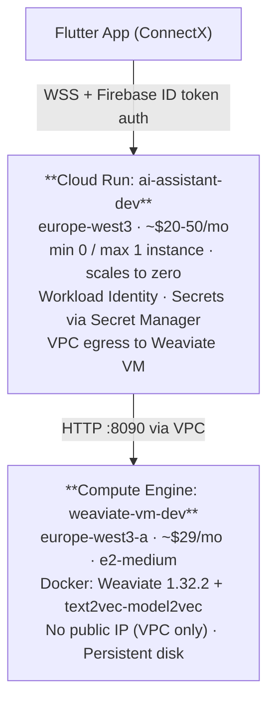
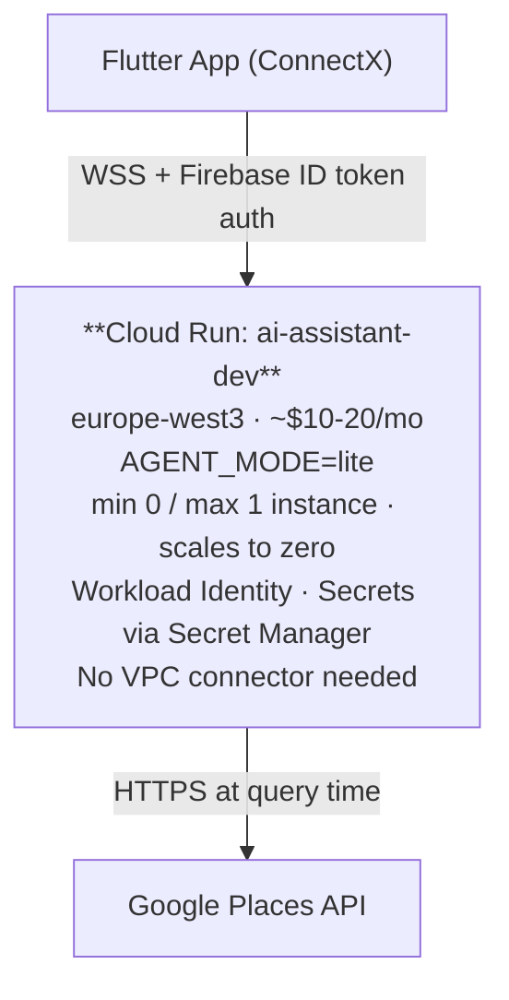
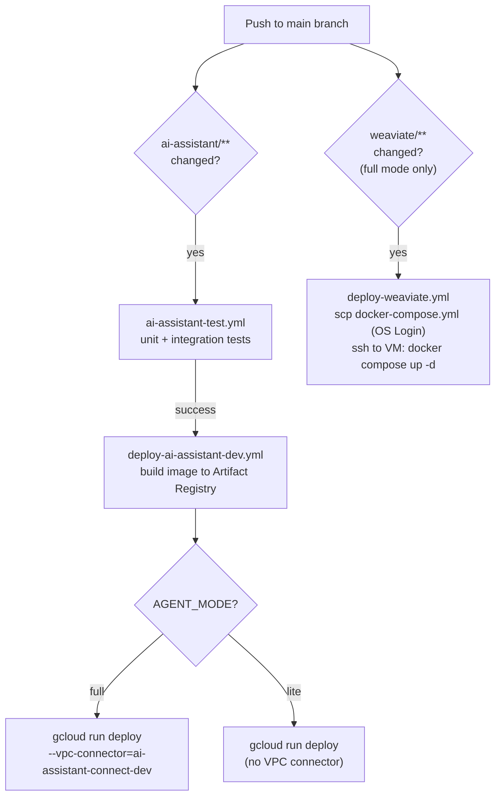

# Cloud Deployment

This document describes how to provision and maintain the production infrastructure on Google Cloud.

## Architecture



**Estimated monthly cost**: ~$50–80 (Cloud Run dev instance scales to zero when idle).  
**Migration path**: change `WEAVIATE_URL` to point at Weaviate Cloud. No other changes are required.

---

## Lite Mode (Cloud Run only)

Set `AGENT_MODE=lite` to run without Weaviate.  The assistant fetches providers
directly from the Google Places API at query time, enriches them via web
crawling, and reranks with a local cross-encoder model.



**Estimated monthly cost**: ~$10–20 (Cloud Run only, no VM).

### Required secrets / env vars

| Secret / env var | Required |
|---|---|
| `GEMINI_API_KEY` | Yes |
| `GOOGLE_PLACES_API_KEY` | Yes |
| `AGENT_MODE` | Set to `lite` |
| Firebase / Firestore credentials | Not needed |
| `WEAVIATE_URL` | Not needed |

### Deploying lite mode to Cloud Run

No Weaviate VM and no VPC connector are required. Steps 6, 7, and 8 from the
one-time setup can be skipped entirely.

```bash
gcloud run deploy ai-assistant-dev \
  --image europe-west3-docker.pkg.dev/<PROJECT_ID>/ai-assistant/ai-assistant:latest \
  --region europe-west3 \
  --service-account linkora-rt-service-account-dev@<PROJECT_ID>.iam.gserviceaccount.com \
  --set-env-vars "AGENT_MODE=lite,PORT=8080" \
  --set-secrets "GEMINI_API_KEY=GEMINI_API_KEY:latest,GOOGLE_PLACES_API_KEY=GOOGLE_PLACES_API_KEY:latest" \
  --min-instances 1 \
  --max-instances 3 \
  --memory 1Gi \
  --cpu 1
```

The `GOOGLE_PLACES_API_KEY` secret must be created in Secret Manager before
the first deploy:

```bash
echo -n "your_places_key" | gcloud secrets create GOOGLE_PLACES_API_KEY \
  --data-file=- --replication-policy=automatic
```

Grant the Runtime SA access to it:

```bash
RT_SA="linkora-rt-service-account-dev@<PROJECT_ID>.iam.gserviceaccount.com"
gcloud secrets add-iam-policy-binding GOOGLE_PLACES_API_KEY \
  --member="serviceAccount:${RT_SA}" \
  --role="roles/secretmanager.secretAccessor"
```

---

## Prerequisites

```bash
# Install gcloud CLI
brew install google-cloud-sdk  # macOS

# Authenticate
gcloud auth login
gcloud config set project <PROJECT_ID>
```

Enable required APIs:
```bash
gcloud services enable \
  run.googleapis.com \
  compute.googleapis.com \
  artifactregistry.googleapis.com \
  secretmanager.googleapis.com \
  iam.googleapis.com \
  iamcredentials.googleapis.com \
  iap.googleapis.com \
  vpcaccess.googleapis.com \
  speech.googleapis.com \
  texttospeech.googleapis.com
```

---

## One-time Setup

### 1. Artifact Registry repository

```bash
gcloud artifacts repositories create ai-assistant-dev \
  --repository-format=docker \
  --location=europe-west3 \
  --description="AI-Assistant container images"
```

### 2. Service accounts

Create the two service accounts (CI = deploys code, RT = runs code at runtime):

```bash
gcloud iam service-accounts create linkora-ci-service-account-dev \
  --display-name="Linkora CI Service Account"

gcloud iam service-accounts create linkora-rt-service-account-dev \
  --display-name="Linkora Runtime Service Account"
```

**CI service account** (`linkora-ci-service-account-dev`): used by GitHub Actions to deploy.

```bash
CI_SA="linkora-ci-service-account-dev@<PROJECT_ID>.iam.gserviceaccount.com"
PROJECT_ID=$(gcloud config get-value project)
PROJECT_NUMBER=$(gcloud projects describe $PROJECT_ID --format="value(projectNumber)")

# Deploy Cloud Run services
gcloud projects add-iam-policy-binding $PROJECT_ID \
  --member="serviceAccount:${CI_SA}" \
  --role="roles/run.admin"

# Push Docker images to Artifact Registry
gcloud projects add-iam-policy-binding $PROJECT_ID \
  --member="serviceAccount:${CI_SA}" \
  --role="roles/artifactregistry.writer"

# SSH/SCP to Compute Engine VM for Weaviate deploys
gcloud projects add-iam-policy-binding $PROJECT_ID \
  --member="serviceAccount:${CI_SA}" \
  --role="roles/compute.instanceAdmin.v1"


# Open IAP TCP tunnel to the VM (required for --tunnel-through-iap)
gcloud projects add-iam-policy-binding $PROJECT_ID \
  --member="serviceAccount:${CI_SA}" \
  --role="roles/iap.tunnelResourceAccessor"

# Allow CI SA to impersonate the default Compute Engine SA
# (required so gcloud compute ssh can inject ephemeral SSH keys)
gcloud iam service-accounts add-iam-policy-binding \
  ${PROJECT_NUMBER}-compute@developer.gserviceaccount.com \
  --member="serviceAccount:${CI_SA}" \
  --role="roles/iam.serviceAccountUser"

# Allow CI SA to deploy Cloud Run using the runtime SA
gcloud iam service-accounts add-iam-policy-binding \
  linkora-rt-service-account-dev@${PROJECT_ID}.iam.gserviceaccount.com \
  --member="serviceAccount:${CI_SA}" \
  --role="roles/iam.serviceAccountUser"

# Create secrets and add new versions on every deploy.
# No predefined role covers both; use a custom role created once below.
gcloud iam roles create secretManagerCiRole \
  --project=$PROJECT_ID \
  --title="Secret Manager CI Role" \
  --description="Create secrets and add versions for CI deploys" \
  --permissions=secretmanager.secrets.create,secretmanager.secrets.get,secretmanager.secrets.list,secretmanager.versions.add \
  --stage=GA

gcloud projects add-iam-policy-binding $PROJECT_ID \
  --member="serviceAccount:${CI_SA}" \
  --role="projects/${PROJECT_ID}/roles/secretManagerCiRole"
```

**Runtime service account** (`linkora-rt-service-account-dev`): attached to Cloud Run; used at runtime.

```bash
RT_SA="linkora-rt-service-account-dev@<PROJECT_ID>.iam.gserviceaccount.com"

# Speech-to-Text (STT) and Text-to-Speech (TTS)
# Note: there is no separate roles/texttospeech.client predefined role.
# TTS access is granted by Workload Identity + the enabled API.
gcloud projects add-iam-policy-binding $PROJECT_ID \
  --member="serviceAccount:${RT_SA}" \
  --role="roles/speech.client"

# Firestore read/write (users, requests, chats, reviews)
gcloud projects add-iam-policy-binding $PROJECT_ID \
  --member="serviceAccount:${RT_SA}" \
  --role="roles/datastore.user"

# Firebase Auth: verify_id_token with check_revoked=True
# Requires a custom role; firebaseauth.users.get is not included in any
# predefined role smaller than roles/firebaseauth.admin.
gcloud iam roles create firebaseAuthTokenChecker \
  --project=$PROJECT_ID \
  --title="Firebase Auth Token Revocation Checker" \
  --description="Allows verify_id_token with check_revoked=True" \
  --permissions=firebaseauth.users.get \
  --stage=GA

gcloud projects add-iam-policy-binding $PROJECT_ID \
  --member="serviceAccount:${RT_SA}" \
  --role="projects/${PROJECT_ID}/roles/firebaseAuthTokenChecker"

# Firebase Auth: verify_id_token (crypto verification only, no user lookup)
gcloud projects add-iam-policy-binding $PROJECT_ID \
  --member="serviceAccount:${RT_SA}" \
  --role="roles/firebaseauth.viewer"

# Read secrets at runtime (GEMINI_API_KEY, ADMIN_SECRET_KEY, METERED_API_KEY)
gcloud projects add-iam-policy-binding $PROJECT_ID \
  --member="serviceAccount:${RT_SA}" \
  --role="roles/secretmanager.secretAccessor"
```

### 3. Workload Identity Federation (GitHub Actions → GCP, no keys)

WIF lets GitHub Actions authenticate to GCP without storing a service account key.

```bash
PROJECT_ID=$(gcloud config get-value project)
PROJECT_NUMBER=$(gcloud projects describe $PROJECT_ID --format="value(projectNumber)")
GITHUB_ORG="Fides-Connect"   # your GitHub org or user
REPO="Linkora"

# Create the WIF pool
gcloud iam workload-identity-pools create linkora-identity-pool-dev \
  --location="global" \
  --display-name="Linkora GitHub Actions Pool"

# Create the OIDC provider
gcloud iam workload-identity-pools providers create-oidc linkora-github-provider-dev \
  --location="global" \
  --workload-identity-pool="linkora-identity-pool-dev" \
  --display-name="GitHub OIDC Provider" \
  --attribute-mapping="google.subject=assertion.sub,attribute.repository=assertion.repository,attribute.ref=assertion.ref" \
  --issuer-uri="https://token.actions.githubusercontent.com"

# Allow the CI SA to be impersonated by the GitHub repo
gcloud iam service-accounts add-iam-policy-binding \
  linkora-ci-service-account-dev@${PROJECT_ID}.iam.gserviceaccount.com \
  --role="roles/iam.workloadIdentityUser" \
  --member="principalSet://iam.googleapis.com/projects/${PROJECT_NUMBER}/locations/global/workloadIdentityPools/linkora-identity-pool-dev/attribute.repository/${GITHUB_ORG}/${REPO}"

# Print the provider resource name for the WIF_PROVIDER GitHub secret
gcloud iam workload-identity-pools providers describe "linkora-github-provider-dev" \
  --location="global" \
  --workload-identity-pool="linkora-identity-pool-dev" \
  --format="value(name)"
```

### 4. Secrets in Secret Manager

The CI workflow handles creation and updates automatically via the `secretManagerCiRole` custom role. No manual pre-creation needed. Just set the corresponding GitHub Actions secrets and push.

### 5. Harden default VPC firewall rules

GCP creates broad default firewall rules. Disable the ones not needed:

```bash
# SSH from the internet: use IAP tunnelling instead (see SSH section below)
gcloud compute firewall-rules update default-allow-ssh --disabled

# RDP: not used on Linux VMs
gcloud compute firewall-rules update default-allow-rdp --disabled
```

Allow SSH from Google IAP only (required for `gcloud compute ssh` without a public IP):

```bash
gcloud compute firewall-rules create allow-ssh-iap \
  --network=default \
  --action=allow \
  --rules=tcp:22 \
  --source-ranges=35.235.240.0/20 \
  --description="SSH via Google IAP tunnelling only"
```

### 6. Weaviate VM

Create the VM **without a public IP** (`--no-address`). All access goes through the VPC: SSH via IAP, Weaviate via the VPC connector.

```bash
gcloud compute instances create weaviate-vm-dev \
  --zone=europe-west3-a \
  --machine-type=e2-medium \
  --image-family=ubuntu-2204-lts \
  --image-project=ubuntu-os-cloud \
  --boot-disk-size=50GB \
  --boot-disk-type=pd-balanced \
  --no-address \
  --tags=weaviate-server \
  --metadata-from-file startup-script=weaviate/startup-script.sh

# Restrict Weaviate ports to internal/VPC traffic only
# (Weaviate runs with anonymous access; never expose publicly)
gcloud compute firewall-rules create allow-weaviate \
  --network=default \
  --action=allow \
  --rules=tcp:8090,tcp:50051 \
  --source-ranges=10.0.0.0/8 \
  --target-tags=weaviate-server \
  --description="Weaviate API from VPC/internal ranges only"

# Reserve a static internal IP so it never changes
gcloud compute addresses create weaviate-vm-static-ip \
  --region=europe-west3 \
  --subnet=default \
  --addresses=$(gcloud compute instances describe weaviate-vm-dev \
      --zone=europe-west3-a \
      --format="value(networkInterfaces[0].networkIP)")

# Get the internal IP for the WEAVIATE_VM_IP GitHub secret
gcloud compute instances describe weaviate-vm-dev \
  --zone=europe-west3-a \
  --format="value(networkInterfaces[0].networkIP)"
```

Wait ~3 minutes for the startup script to finish, then verify via IAP:

```bash
# SSH via IAP (no public IP required)
gcloud compute ssh weaviate-vm-dev --zone=europe-west3-a --tunnel-through-iap

# Inside VM: check Weaviate is healthy
curl http://localhost:8090/v1/.well-known/ready
```

### 7. Initialize Weaviate schema

```bash
# Port-forward via IAP tunnel
gcloud compute ssh weaviate-vm-dev --zone=europe-west3-a --tunnel-through-iap -- \
  -L 8090:localhost:8080 -N &
SSH_PID=$!
sleep 3

cd ai-assistant
WEAVIATE_URL=http://localhost:8090 python scripts/init_database.py --load-test-data

kill $SSH_PID
```

### 8. Serverless VPC Access connector

Cloud Run cannot reach private RFC-1918 IPs by default. The VPC connector routes private-range egress from Cloud Run to the Weaviate VM.

```bash
# Create the connector (one-time per region)
gcloud compute networks vpc-access connectors create ai-assistant-connect-dev \
  --region=europe-west3 \
  --network=default \
  --range=10.8.0.0/28
```

The connector name is referenced in `cloud-deploy.yml` via the `WEAVIATE_VPC_CONNECTOR` GitHub secret. The workflow automatically attaches it on every deploy via `--vpc-connector` and `--vpc-egress=private-ranges-only`.

### 9. Allow public access to Cloud Run (required for mobile clients)

Cloud Run defaults to requiring Google OIDC IAM authentication, which mobile apps cannot satisfy. The application enforces its own Firebase ID token auth on every request. The Cloud Run IAM layer must be `allUsers`.

**Grant public invoker access:**

Run once after the initial deployment (the CI workflow re-deploys but does not re-grant this):

```bash
gcloud run services add-iam-policy-binding ai-assistant-dev \
  --region=europe-west3 \
  --member=allUsers \
  --role=roles/run.invoker
```

> **Why this is safe**: This only removes Google OIDC at the Cloud Run network edge. Every REST endpoint verifies the Firebase ID token via `get_current_user_id()` in `api/deps.py` (returns 401 on failure). The WebSocket endpoint verifies via `firebase_auth.verify_id_token()` in `signaling_server.py`.

Add these in **Settings → Secrets and variables → Actions**:

**Secrets required for both modes:**

| Secret | Value / where to get it |
|---|---|
| `GCP_PROJECT_ID` | `gcloud config get-value project` |
| `WIF_PROVIDER` | Output of WIF provider describe command in step 3 |
| `WIF_CI_SERVICE_ACCOUNT` | `linkora-ci-service-account-dev@<PROJECT_ID>.iam.gserviceaccount.com` |
| `WIF_RT_SERVICE_ACCOUNT` | `linkora-rt-service-account-dev@<PROJECT_ID>.iam.gserviceaccount.com` |
| `GEMINI_API_KEY` | Your Gemini API key (synced to Secret Manager by the workflow) |
| `ADMIN_SECRET_KEY` | Your admin API secret (synced to Secret Manager by the workflow) |

**Additional secrets for full mode (`AGENT_MODE=full`):**

| Secret | Value / where to get it |
|---|---|
| `WEAVIATE_VM_NAME` | `weaviate-vm-dev` |
| `WEAVIATE_VM_ZONE` | `europe-west3-a` |
| `WEAVIATE_VM_IP` | Internal IP from step 6 (e.g. `10.156.0.6`) |
| `WEAVIATE_VM_PORT` | `8090` (host port mapped in docker-compose.yml) |
| `WEAVIATE_VPC_CONNECTOR` | `ai-assistant-connect-dev` |
| `METERED_APP_NAME` | Your Metered.ca application name (subdomain of `metered.live`; synced to Secret Manager by the workflow) |
| `METERED_API_KEY` | Your Metered.ca API key (synced to Secret Manager by the workflow) |

**Additional secrets for lite mode (`AGENT_MODE=lite`):**

| Secret | Value / where to get it |
|---|---|
| `GOOGLE_PLACES_API_KEY` | Your Google Places API key (synced to Secret Manager by the workflow) |

The workflow syncs secrets into Secret Manager on every deploy. Cloud Run injects them at runtime via `--set-secrets` (never in plain environment variables).

---

## CI/CD Pipeline



---

## Manual Operations

### Redeploy AI-Assistant without a code change

**Full mode** (with VPC connector for Weaviate):
```bash
gcloud run deploy ai-assistant-dev \
  --image europe-west3-docker.pkg.dev/<PROJECT_ID>/ai-assistant/ai-assistant:latest \
  --region europe-west3 \
  --vpc-connector=ai-assistant-connect-dev \
  --vpc-egress=private-ranges-only
```

**Lite mode** (no VPC connector):
```bash
gcloud run deploy ai-assistant-dev \
  --image europe-west3-docker.pkg.dev/<PROJECT_ID>/ai-assistant/ai-assistant:latest \
  --region europe-west3
```

### SSH into Weaviate VM

The VM has no public IP and `default-allow-ssh` is disabled. Use IAP tunnelling:

```bash
gcloud compute ssh weaviate-vm-dev --zone=europe-west3-a --tunnel-through-iap
# Inside VM:
cd /opt/weaviate
docker compose ps
docker compose logs -f weaviate
```

### Backup Weaviate data

```bash
gcloud compute ssh weaviate-vm-dev --zone=europe-west3-a --tunnel-through-iap -- \
  "docker exec weaviate /bin/sh -c 'weaviate-backup create --id backup-\$(date +%Y%m%d)'"
```

---

## Migrating Weaviate to Weaviate Cloud

1. Export data from the VM (or let Weaviate Cloud re-index from source data).
2. Create a cluster on [Weaviate Cloud](https://console.weaviate.cloud).
3. Run `scripts/init_database.py` pointing at the new cluster URL.
4. Add a **new** `WEAVIATE_URL` GitHub Actions secret with the full Weaviate Cloud URL:
   ```
   WEAVIATE_URL=https://your-cluster.weaviate.network
   ```
5. Update `cloud-deploy.yml` to pass `WEAVIATE_URL` directly instead of composing it from `WEAVIATE_VM_IP` and `WEAVIATE_VM_PORT`:
   ```yaml
   --set-env-vars "WEAVIATE_URL=${{ secrets.WEAVIATE_URL }}, ..."
   ```
6. Redeploy AI-Assistant (see above).
7. Shut down the VM:
   ```bash
   gcloud compute instances delete weaviate-vm-dev --zone=europe-west3-a
   ```

No application code changes are needed. Only `WEAVIATE_URL` and the CI workflow need to point at the Weaviate Cloud endpoint.
